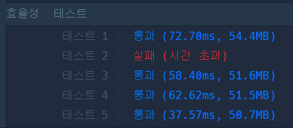
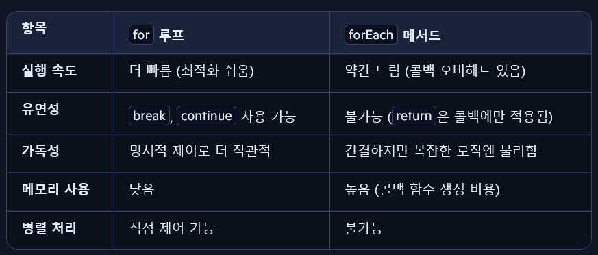

## 1. 10진수를 2진수로 변환하기

```
제약 조건: decimal = 0이상 10억 미만 자연수
```
소스 코드
```js
solution(decimal){
    const binary_stack = [];
    let temp = decimal;
    while(decimal > 1){
        binary_stack.push(temp%2);
        temp = Math.floor(temp/2);
    }
    binary_stack.push(temp);

    return binary_stack.reverse().join("");
}
```
## 2. 괄호 회전하기

`문제 설명`

다음 규칙을 지키는 문자열을 올바른 괄호 문자열이라고 정의합니다.

(), [], {} 는 모두 올바른 괄호 문자열입니다.
만약 A가 올바른 괄호 문자열이라면, (A), [A], {A} 도 올바른 괄호 문자열입니다. 예를 들어, [] 가 올바른 괄호 문자열이므로, ([]) 도 올바른 괄호 문자열입니다.
만약 A, B가 올바른 괄호 문자열이라면, AB 도 올바른 괄호 문자열입니다. 예를 들어, {} 와 ([]) 가 올바른 괄호 문자열이므로, {}([]) 도 올바른 괄호 문자열입니다.
대괄호, 중괄호, 그리고 소괄호로 이루어진 문자열 s가 매개변수로 주어집니다. 이 s를 왼쪽으로 x (0 ≤ x < (s의 길이)) 칸만큼 회전시켰을 때 s가 올바른 괄호 문자열이 되게 하는 x의 개수를 return 하도록 solution 함수를 완성해주세요.


```js
function solution(s) {
    let cntCorrect = 0;
    let my_arr = [...s];
    for(let i=0; i<s.length; i++){
        cntCorrect += isCorrect(my_arr) ? 1 : 0;
        my_arr.push(my_arr.shift());//회전    
    }
    return cntCorrect;
}

function isCorrect(s){
    let buffer = [];
    const match = {
        "]" :"[" ,
        "}" : "{",
        ")" : "("
    }
    for(let i=0; i<s.length; i++){
        //push와 pop이 문제의 핵심.(스택)
        if(s[i]==="["||s[i]==="{"||s[i]==="("){
            buffer.push(s[i]);
        }else{
            if(buffer.pop() !== (match[s[i]])){
                return false;
            }
        }
    }
    if(buffer.length===0){return true;}
    else{return false;}
}
```

스택에 열린 괄호를 저장하고 스택 마지막 요소 (pop) 과 닫힌 괄호가 세트가 아니면 false,
또는 짝이 없는 열린 괄호가 남아 있으면 false를 반환하고,
그외 true를 반환하는 함수를 만들었습니다.

모든 회전에 대해서 검사해서 
올바른 괄호 문자열의 개수를 반환합니다.

## 짝지어 제거하기

`문제 설명`

짝지어 제거하기는, 알파벳 소문자로 이루어진 문자열을 가지고 시작합니다. 먼저 문자열에서 같은 알파벳이 2개 붙어 있는 짝을 찾습니다. 그다음, 그 둘을 제거한 뒤, 앞뒤로 문자열을 이어 붙입니다. 이 과정을 반복해서 문자열을 모두 제거한다면 짝지어 제거하기가 종료됩니다. 문자열 S가 주어졌을 때, 짝지어 제거하기를 성공적으로 수행할 수 있는지 반환하는 함수를 완성해 주세요. 성공적으로 수행할 수 있으면 1을, 아닐 경우 0을 리턴해주면 됩니다.

예를 들어, 문자열 S = baabaa 라면

b aa baa → bb aa → aa →

의 순서로 문자열을 모두 제거할 수 있으므로 1을 반환합니다.

 <br/>
효율성 테스트라뇨;;

원래 코드 (실패)
```js
function solution(s)
{
    const stack = [];
    [...s].forEach(e=>{
        if(stack[stack.length-1]===e){
            stack.pop();
        }else{
            stack.push(e);
        }
    });
    return stack.length > 0 ? 0 : 1
}
```
forEach는 콜백 함수 호출이 반복되어서 성능 측면에서 떨어진다고 합니다. for는 대용량 문자열에 적합하다고 합니다.



개선 코드 (성공)
```js
function solution(s) {
    const stack = [];
    for (let i = 0; i < s.length; i++) {
        const last = stack[stack.length - 1];
        if (last === s[i]) {
            stack.pop();
        } else {
            stack.push(s[i]);
        }
    }
    return stack.length === 0 ? 1 : 0;
}
```

