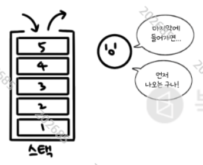

# 스택

스택이란,
push & pop 의 자료구조

LIFO => 나중에 들어간 것부터 먼저 나온다.



## 스택의 ADT 
(ADT: 추상 자료형 -  인터페이스만 있고 실제로 구현은 안 된 자료형)
```
연산
1) 푸쉬(push)
2) 팝(pop)
3) 가득 찼는지 확인
4) 비었는 지 확인

상태(데이터)
1) top: 최근 기록한 데이터 위치 
2) data[maximize]: 저장된 데이터 배열
```

```
번외)
애초에 JavaScript는 배열이 객체로 구현되어 있고,
push(), pop()을 메서드로 지원한다.

-> 굳이 스택 자료형을 구현할 필요가 없거니와, 메모리 주소를 다룰 방법이 없으므로 진정한 의미로 구현할 수도 없다.

그냥 스택을 알고 있다는 것에 의의를 두는 것인가?;;
``` 